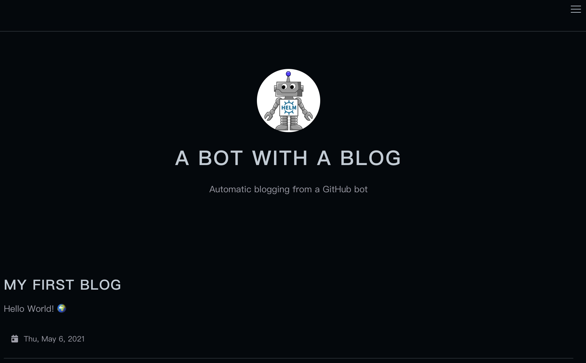
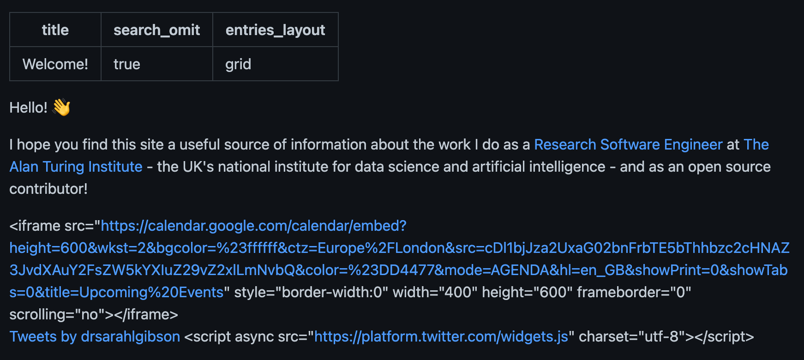
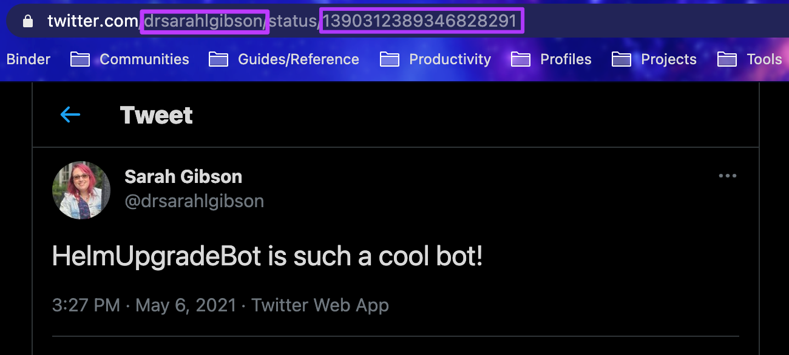

::::::::::::::::::::::::::::::::::::::: objectives

- Add a profile picture to our blog site
- Create our first blog post
- Embed a tweet into our blog post

::::::::::::::::::::::::::::::::::::::::::::::::::

:::::::::::::::::::::::::::::::::::::::: questions

- How do we add a profile picture to our blog site?
- How do we create a new blog post with Hugo?
- What frontmatter does Hugo create for posts?
- How do we embed external content into our posts?

::::::::::::::::::::::::::::::::::::::::::::::::::

The episodes we have covered so far involve setting up the repository to publish the website on GitHub Pages.
These should be considered one-time tasks that may only need tweaking once setup.
In this episode, we will cover the more regular processes of publishing new content, such as blog posts.

Let's start to make our site a little more attractive by adding some content.
Let's give our site a profile picture, publish our first blog post and embed some external content into it - in this case, a tweet.

First, check out a new branch to add content to:

```bash
git checkout -b adding-content
```

```output
Switched to a new branch 'adding-content'
```

### Profile Picture

It'll be good for people to know who we are by adding a photo of us or a logo that reflects our branding!

1. Images go into a special folder that Hugo will parse when generating the HTML - so let's create that folder.
  
  ```bash
  mkdir -p static/images
  ```

2. Now copy an image (of you, a logo, your pet!) into this folder.
  You can do this by just saving an image directly into the folder or using the below bash command.
  We'll use the example filename `profile_pic.png`.
  What your image is called isn't really important, just remember it!
  
  ```bash
  # Example only - this command won't actually work!
  cp /path/to/my/picture.png ./static/images/profile_pic.png
  ```

3. We let Hugo know where our profile picture is by adding the following line to the bottom of our `config.toml` file.
  
  ```toml
  profilePicture = "images/profile_pic.png"
  ```
  
  **Note:** notice how we didn't have to define the path as `static/images/profile_pic.png` here?
  That's because `static` is a special folder to Hugo that it knows how to parse.
  In fact, it's called `static` as Hugo won't modify these files in any way, just import them into the HTML files it creates - hence they are "static".
  
4. Run the `hugo server` command again and visit [http://localhost:1313](https://localhost:1313) in your browser. You should now see your image on your site! :tada:
  
  ```bash
  hugo server
  ```
  
  {alt='Blog homepage with profile picture'}                                                    

**Close your browser window displaying your website and run <kbd>Ctrl</kbd>\+<kbd>C</kbd> in your terminal to stop the hugo server command.**

### Creating a blog post

Next let's add our first blog post!
This is equivalent to creating a new Markdown file with some extra metadata that Hugo will read.
Hugo has a built in command to generate new Markdown files with the appropriate metadata and it will deposit all of these in the `content` folder.
The command looks like this:

```bash
# Example only - don't run this!
# (It'll work, but it's probably not what you want)
hugo new path/to/content.md
```

**Note:** if any of the folders `path/` or `to/` don't already exist under `content/`, Hugo will create them automatically.


1. So let's create a new blog post by running:
  
  ```bash
  hugo new blog/my-first-blog.md
  ```
  
  This will create the `my-first-blog.md` Markdown file in the `blog` folder underneath the `content` folder.

2. If you open this file, you will see that it is not empty!
  
  ```text
  ---
  title: "My First Blog"
  date: 2021-05-06T13:40:20+01:00
  draft: true
  ---
  ```
  
  This is the metadata Hugo generates that we talked about before.
  Hugo has prefilled the `title` field from the name of the Markdown file, the timestamp of when the file was created, and it has automatically put the file into draft mode.
  
  Draft mode means that Hugo will **NOT** build and publish this file unless the `--buildDrafts [-D]` flag is passed to the `hugo server` command or the metadata is changed to `draft: false`.
  
  You can edit these fields as you wish.
  It is **strongly recommend** to update the `draft` field to `false` right now so that it will automatically build when this file is merged to `main`.
  
  You can then write your content underneath the metadata field as you like.
  Let's leave the message "Hello World! :earth\_africa:"
  All together, the file looks like this:
  
  ```text
  ---
  title: "My First Blog"
  date: 2021-05-06T13:40:20+01:00
  draft: false
  ---
  
  Hello World! :earth_africa:
  ```

3. We'll edit the `config.toml` again to place our blog post on the homepage of our site.
  Add the following line to the bottom of the file:
  
  ```toml
  mainSections = ["blog"]
  ```

4. Run the `hugo server` command again and visit [http://localhost:1313](https://localhost:1313) in your browser.
  You should now see your blog post listed on your site with, as promised, a properly rendered emoji!
  You can then click through to the full post.
  
  ```bash
  hugo server
  ```
  
  {alt='Homepage with a blog post listed '}                                                        

**Close your browser window displaying your website and run <kbd>Ctrl</kbd>\+<kbd>C</kbd> in your terminal to stop the hugo server command.**

### Embedding External Content using Hugo Shortcodes

The beauty of using Markdown to build a blogsite is that it is a very simple file format - what you type is what is rendered.
However, blogs often contain *more* than just words (images, tweets, videos) and Markdown is not always equipped to cope with all of these extra sources.
The solution would be to manually construct a HTML block to embed the content, which breaks the simplicity of the Markdown document.

{alt='An example of a Markdown file using HTML blocks to embed a Google calendar and Twitter timeline into a blog page'}                                                                        

Hugo's solution to this problem is to provide a set of [shortcodes](https://gohugo.io/content-management/shortcodes/#use-hugos-built-in-shortcodes) that handle this embedding in the backend for a range of external sources including instagram, twitter, youtube, and more.
So let's experiment by adding a tweet to our blog post.

Here is a tweet claiming how cool HelmUpgradeBot is: <https://twitter.com/drsarahlgibson/status/1390312389346828291>.
All we need to embed this tweet into our blog post is the tweet ID (the **numeric** part of the tweet URL) and the user who tweeted it.

{alt='The ID of a tweet is the numerical section of the URL'}                                 

The syntax for embedding a tweet is then:

```source

```

Which is much shorter than the corresponding HTML!

So to add the above tweet to our blog post, edit the `content/blog/my-first-post.md` file again and add the following code to the end of the file.

```text

```

All together, the file now looks like this:

```text
---
title: "My First Blog"
date: 2021-05-06T13:40:20+01:00
draft: false
---

Hello World! :earth_africa:


```

Save and close the file, then rerun `hugo server` and visit [http://localhost:1313](https://localhost:1313) in your browser again.
The tweet won't show up in the short summary of the blog post on the homepage, but if you click through, it should be embedded in the full blog page!

```bash
hugo server
```

{alt='Blog post with embedded tweet'}                                                                          

**Close your browser window displaying your website and run <kbd>Ctrl</kbd>\+<kbd>C</kbd> in your terminal to stop the hugo server command.**

Other shortcodes you will find useful are:

- [`figure`](https://gohugo.io/content-management/shortcodes/) for linking an image from a URL
- [`ref` and `relref`](https://gohugo.io/content-management/shortcodes/) for creating links within your blog, such as to another post or section of a post

:::::::::::::::::::::::::::::::::::::::::  callout

## Adding own image to a site

Want to add your own image to your site by committing it to GitHub?
Add it to the `static/images` folder, as we did with the profile picture.
You can then include the image using the standard Markdown syntax ``

::::::::::::::::::::::::::::::::::::::::::::::::::

:::::::::::::::::::::::::::::::::::::::::  callout

## Creating own shortcodes

If you are feeling **super brave**, you can even [create your own shortcodes](https://gohugo.io/templates/shortcode-templates/) to embed specific content.
Check out [some examples](https://github.com/sgibson91/sgibson91.github.io/tree/main/layouts/shortcodes).


::::::::::::::::::::::::::::::::::::::::::::::::::

### Pushing to GitHub and Merging to `main`

Let's save what we've done to GitHub and set it live on the website using the same add, commit, push, open and merge Pull Request that we've used in episodes [2](02-locally-setup-hugo.md) and [3](03-push-to-github.md).

```bash
git add .
```

```bash
git commit -m "Add our first blog post to the website"
```

```output
[adding-content 8038986] Add our first blog post to the website
 2 files changed, 9 insertions(+)
 create mode 100644 content/blog/my-first-blog.md
```

```bash
git push origin adding-content
```

```output
Enumerating objects: 8, done.
Counting objects: 100% (8/8), done.
Delta compression using up to 4 threads
Compressing objects: 100% (4/4), done.
Writing objects: 100% (6/6), 598 bytes | 598.00 KiB/s, done.
Total 6 (delta 1), reused 0 (delta 0), pack-reused 0
remote: Resolving deltas: 100% (1/1), completed with 1 local object.
remote:
remote: Create a pull request for 'adding-content' on GitHub by visiting:
remote:      https://github.com/HelmUpgradeBot/HelmUpgradeBot.github.io/pull/new/adding-content
remote:
To https://github.com/HelmUpgradeBot/HelmUpgradeBot.github.io.git
 * [new branch]      adding-content -> adding-content
```

1. On the GitHub interface, click "Create \& pull request"
2. Give your PR an informative title and summary, then click "Create pull request"
3. After the continuous integration test has passed, click "Merge pull request" then "Confirm merge"

While waiting for CD/GitHub Pages to deploy the update, let's update our local repo.

```bash
git checkout main
```

```output
Switched to branch 'main'
Your branch is up to date with 'origin/main'.
```

```bash
git pull
```

```output
remote: Enumerating objects: 12, done.
remote: Counting objects: 100% (12/12), done.
remote: Compressing objects: 100% (5/5), done.
remote: Total 10 (delta 2), reused 9 (delta 2), pack-reused 0
Unpacking objects: 100% (10/10), 1.57 KiB | 161.00 KiB/s, done.
From https://github.com/HelmUpgradeBot/HelmUpgradeBot.github.io
   dfed2bc..85e39a8  main       -> origin/main
 * [new branch]      gh-pages   -> origin/gh-pages
Updating dfed2bc..85e39a8
Fast-forward
 config.toml                   | 3 +++
 content/blog/my-first-blog.md | 6 ++++++
 2 files changed, 9 insertions(+)
 create mode 100644 content/blog/my-first-blog.md
```

Then visit `https://YOUR-USERNAME.github.io` in the browser to see your site live.


:::::::::::::::::::::::::::::::::::::::: keypoints

- Files to be included in the site, without modification, should be placed under the `static` folder
- New content is generated with the `hugo new` command
- Hugo automatically generates `title`, `date` and `draft` frontmatter for content
- External content is embedded into posts using shortcodes

::::::::::::::::::::::::::::::::::::::::::::::::::


