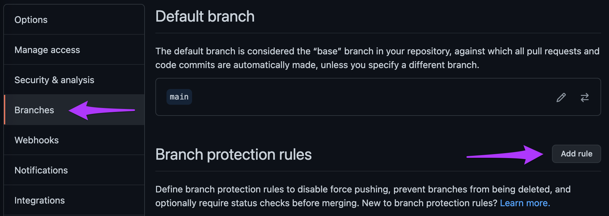

In this episode, we will use [GitHub Actions](https://docs.github.com/en/actions) to define a Continuous Deployment pipeline that will automatically update our webite when we merge Pull Requests in GitHub.

The concept of Continuous Deployment is as follows:

> For every change we integrate or merge into our GitHub repo, a fresh version of our website should be created and deployed automatically for us.
{: .quotation}

1. Let's start by checking out a new branch in our local repo.

    ~~~
    git checkout -b add-cd
    ~~~
    {: .language-bash}

    ~~~
    Switched to a new branch 'add-cd'
    ~~~
    {: .output}

2. GitHub Actions are automatically triggered by files that are stored in a special folder called `.github/workflows`.
   So let's create that folder!

    ~~~
    mkdir -p .github/workflows
    ~~~
    {: .language-bash}

    > ## For your information
    >
    > The `-p` flag here means "If the parent directory doesn't already exist (i.e. `.github/`), then please create that too."
    > Try running the above command without this flag first and see what error message you get!
    {: .callout}

3. Create a `cd.yml` (`cd` is short for **C**ontinuous **D**eployment) file inside the `.github/workflows` folder and open it in your favourite text editor.
   (Find out more about the YAML (`.yml`) file format in [this blog post](https://blog.stackpath.com/yaml/).)
4. We have a workflow ready for us to use below which you should feel free to copy and paste into your `cd.yml` file, and then we'll go through each section.

> ## Whitespace **matters** with YAML so be careful when you copy and paste!
>
> What does “whitespace matters” mean?
> Why is it important?
>
> It means that the spaces in the file carry meaning. A bit like how in Python if you indent lines then it knows they’re part of a for loop.
> The way that a for loop ends is that you don’t indent the next line.
> Think about replacing the whitespace (either spaces or tabs) with characters, such as dots.
> 4 dots (....) which represent 4 spaces (    ) tells the file that this new information belongs to the line above.
> In some programming languages whitespace doesn’t matter - newlines might matter but **where** you put the words is only important for what it looks like, not what actually happens.
> Python, Markdown, YAML all depend on whitespace to understand what the developer means.
{: .discussion}

~~~
name: Build and Deploy Site

on:
  push:
    branches:
      - main
  pull_request:
    branches:
      - main

jobs:
  build-and-deploy-site:
    runs-on: ubuntu-latest
    steps:
      - name: Checkout repo
        uses: actions/checkout@v2
        with:
          submodules: true
          fetch-depth: 0

      - name: Setup Hugo
        uses: peaceiris/actions-hugo@v2
        with:
          hugo-version: 'latest'

      - name: Build site with Hugo
        run: hugo --minify

      - name: Check HTML
        uses: chabad360/htmlproofer@master
        with:
          directory: "./public"
          arguments: --only-4xx --check-favicon --check-html --assume-extension --empty-alt-ignore --disable-external
        continue-on-error: true

      - name: Deploy to GitHub Pages
        if: github.event_name == 'push' && github.ref == 'refs/heads/main'
        uses: peaceiris/actions-gh-pages@v3
        with:
          github_token: ${{ secrets.GITHUB_TOKEN }}
          publish_dir: ./public
~~~
{: .language-yaml}

- The `name` parameter defines what our workflow should be called
- The `on` block beginning defines what events should trigger our workflow to run.
  We have two defined here:
    - `on.push.branches = [main]`: This tells GitHub Actions to run the workflow whenever a push is made to the `main` branch.
      This is most commonly when a PR is merged.
    - `on.pull_request.branches = [main]`: This tells GitHub Actions to run the workflow every time a PR intending to merge something into the `main` branch is opened.
- The `jobs` section defines which jobs the workflow will run when triggered.
  We have one job to run called `build-and-deploy-site` and we have requested the latest version of the Ubuntu Operating System to run this job on (Windows and Mac OSs are also available to execute jobs).
- The `steps` section, underneath `jobs.<job_name>`, defines each step involving in running the job.
  - Step 1 is a checkout step.
    This clones the repo like we did manually in [step 3 of episode 2]({{ page.root }}).
    The `fetch-depth: 0` line asks GitHub to not download the full repo history, only the most recent commit, and the `submodules: true` line asks GitHub to also checkout the submodules we depend on.
    Without this, our `themes` folder won't be populated with the info we need to build the site!
  - Step 2 installs the latest version of Hugo.
  - Step 3 builds the site using Hugo.
    The `--minify` flag ensures that the output HTML files are compressed to take up the minimum amount of space required.
    The ouput files are stored in a folder called `public/`.
  - Step 4 runs a tool called `htmlproofer` over the generated HTML files in `public`.
    This tool checks for things like broken links across the site.
    - This step has the `continue-on-error` flag set to `true` allowing the deployment process to continue even if `htmlproofer` discovers errors.
    This is because this step will fail since, for example, we do not setup [favicons](https://en.wikipedia.org/wiki/Favicon) during this lesson and this is one of the properties the tool checks.
  - Step 5 will commit the HTML files to a new branch on our repo called `gh-pages`.
    It only publishes the HTML files contained in the `public` directory as they are the only ones required to create the site at this point.
    - Note this step has an `if` statement that states this step should only be executed when the event that triggered the workflow was a push to the `main` branch (most commonly a merged PR).
      This prevents the live website being redeployed by unreviewed/unapproved changes in a PR.
    - This step also requires a secret `GITHUB_TOKEN`.
      You do not have to worry about creating and/or storing this token.
      It is a special token that is automatically generated by GitHub for every triggered workflow run and allows the workflow to commit and publish new branches.
      GitHub [released a blog post](https://github.blog/changelog/2021-04-20-github-actions-control-permissions-for-github_token/) discussing how to control the permissions of this token.

Add, commit and push the `cd.yml` file to GitHub as we did in [episode 3]({{ page.root }}).

~~~
git add .github/workflows/cd.yml
git commit -m "Add a GitHub Actions workflow to build and deploy the site"
~~~
{: .language-bash}

~~~
[add-cd 92c9552] Add a GitHub Actions workflow to build and deploy the site
 1 file changed, 41 insertions(+)
 create mode 100644 .github/workflows/cd.yml
~~~
{: .output}

~~~
git push origin add-cd
~~~
{: .language-bash}

~~~
Enumerating objects: 6, done.
Counting objects: 100% (6/6), done.
Delta compression using up to 4 threads
Compressing objects: 100% (3/3), done.
Writing objects: 100% (5/5), 875 bytes | 875.00 KiB/s, done.
Total 5 (delta 1), reused 0 (delta 0), pack-reused 0
remote: Resolving deltas: 100% (1/1), completed with 1 local object.
remote:
remote: Create a pull request for 'add-cd' on GitHub by visiting:
remote:      https://github.com/HelmUpgradeBot/HelmUpgradeBot.github.io/pull/new/add-cd
remote:
To https://github.com/HelmUpgradeBot/HelmUpgradeBot.github.io.git
 * [new branch]      add-cd -> add-cd
~~~
{: .output}

Create another PR in GitHub's browser interface as we did in [episode 3]({{ page.root }}).
You should see the check now running and report a status at the bottom of the open PR page!
Merge the PR once the test has passed.
At any point, you can click the "Actions" tab at the top of the GitHub page to see the status of your GitHub Action workflows.

We now need to configure some more settings for the GitHub repo.

1. Click the "Settings" tab along the top of the GitHub webpage.
2. Select "Branches" from the menu on the left-hand-side (4th option from the top).
3. We will add a branch protection rule to prevent changes that could break our site from being deployed.
   Click "Add rule".

    |  |
    | :---: |
    | Add a branch protection rule to the repo |

4. In the "Branch pattern name" type `main`, then select the "Require status checks to pass before merging" box.
   Finally select the `build-and-deploy-site` status check from the list and click "Create" at the bottom of the page.
   (You may be asked to reenter your GitHub password.)
   This means that the `build-and-deploy-site` job **MUST** pass, otherwise merging the PR will be blocked.

    |  |
    | :---: |
    | Create the branch protection rule |

5. Now select the "Pages" option from the left-hand-side menu (second option from the bottom).
   This is where we configure GitHub Pages to host the website.
6. In the "Source" section, select `gh-pages` from the "Branch" dropdown and leave the folder dropdown as `/ (root)`.
   Then click "Save".

    |  |
    | :---: |
    | Configure GitHub Pages in the repo Settings |

7. After a few moments, refresh the page.
   The banner along the top should now be green and read "Your site is published at `https://HelmUpgradeBot.github.io`".
   Click the link in the browser and see your site live!

**Congratulations! Your site is now live on GitHub Pages!**

It's still a little bare though, so let's update our local repo in our terminal and then add some content.

**Close your browser window displaying your website and run <kbd>Ctrl</kbd>+<kbd>C</kbd> in your terminal to stop the hugo server command.**

~~~
git checkout main
~~~
{: .language-bash}

~~~
Switched to branch 'main'
Your branch is up to date with 'origin/main'.
~~~
{: .output}

~~~
git pull
~~~
{: .language-bash}

~~~
remote: Enumerating objects: 1, done.
remote: Counting objects: 100% (1/1), done.
remote: Total 1 (delta 0), reused 0 (delta 0), pack-reused 0
Unpacking objects: 100% (1/1), 654 bytes | 654.00 KiB/s, done.
From https://github.com/HelmUpgradeBot/HelmUpgradeBot.github.io
   cd19a8f..dfed2bc  main       -> origin/main
Updating cd19a8f..dfed2bc
Fast-forward
 .github/workflows/cd.yml | 41 +++++++++++++++++++++++++++++++++++++++++
 1 file changed, 41 insertions(+)
 create mode 100644 .github/workflows/cd.yml
~~~
{: .output}


