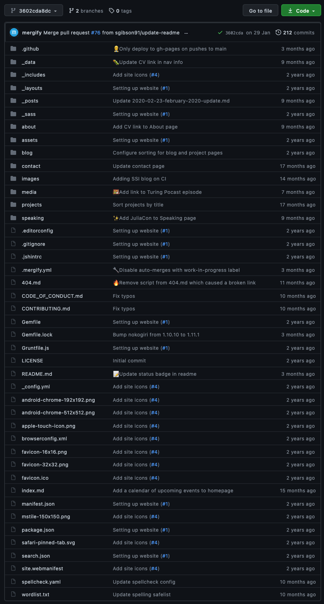
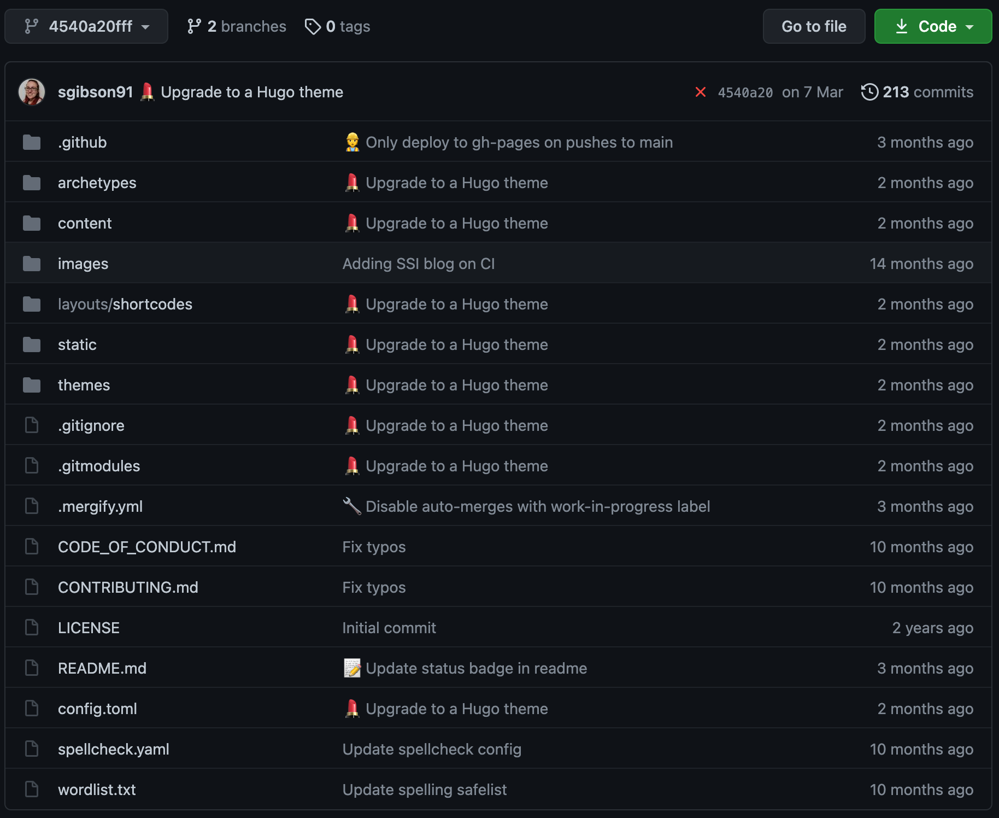
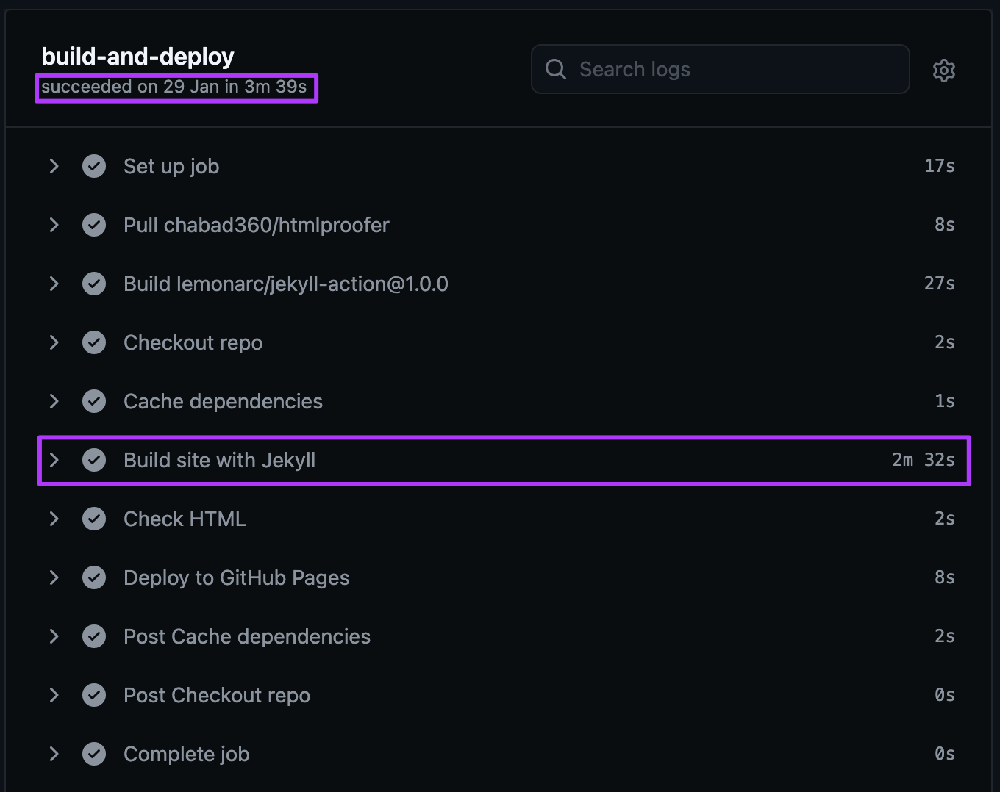
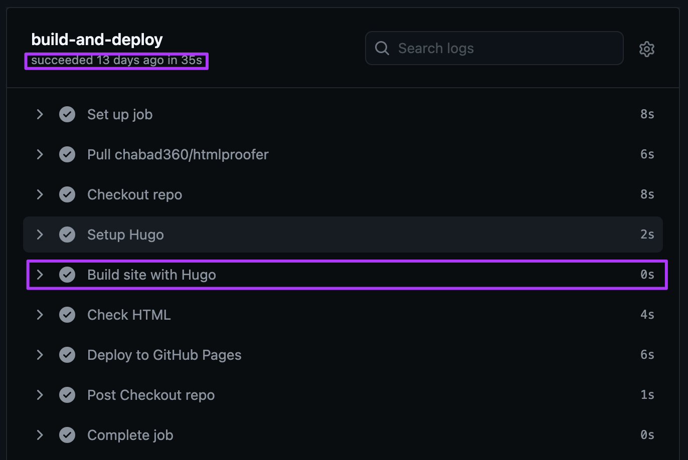
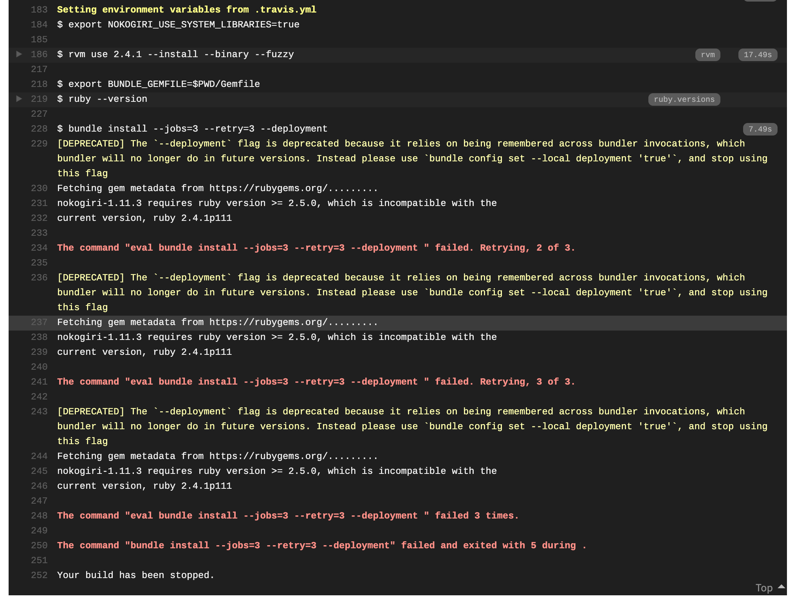

In this section, we'll discuss the use of the terminal and the differences between Hugo and Jekyll for creating blog sites.

## 🤷🏻‍♀️ Do I have to use a terminal?

No!
GitHub offers a limited selection of built-in [Jekyll](https://jekyllrb.com/) templates that can be accessed through a GitHub repository's settings.
See the guide [here](https://docs.github.com/en/pages/getting-started-with-github-pages/creating-a-github-pages-site).

However, that is using _Jekyll_ (another tool for generating blog html sites) and we will be using _Hugo_ in this lesson.
Hugo has not yet been integrated with GitHub Pages like Jekyll has, so we will have to use the terminal throughout this lesson.

## ❓ Ok... So why Hugo and not Jekyll?

**Here is why the lesson's author, Sarah Gibson, prefers to use Hugo over Jekyll:**

It's my personal preference, but I think I arrived at this preference via a few technologically sound principals.
I'll demonstrate using the evolution of my own website as an example.

- **Using Hugo makes for cleaner repositories.**

Jekyll requires a lot of extra "stuff" (such as style templates for html rendering) to be committed directly to the repository which just made it harder for me to work out _where_ I was supposed to put things.
Hugo uses [git submodules](https://git-scm.com/book/en/v2/Git-Tools-Submodules) to make the same stuff available to your website without actually including it.
(But Sarah, aren't [submodules awful](https://medium.com/@porteneuve/mastering-git-submodules-34c65e940407)?
Well... yes. But I personally find the trade off worth it.)

|  |  |
| :---: | :---: |
| Repo layout with Jekyll | Repo layout with Hugo |

- **Hugo builds are faster than Jekyll's.**

I'm just gonna let the screenshots speak for themselves on this one...
But basically, building with Hugo is pretty much instantaneous, whereas Jekyll can take minutes to build.

|  |  |
| :---: | :---: |
| Build time with Jekyll | Build time with Hugo |

- **Hugo has far fewer dependencies than Jekyll.**

Hugo is built on [Go](https://golang.org/), whereas [Jekyll requires Ruby, RubyGems (and bundler to install them), GCC (a type of compiler) and Make](https://jekyllrb.com/docs/#prerequisites) - all of which adds up to be a difficult environment to setup and maintain.

|  |
| :---: |
| A broken Travis CI build due caused by an outdated bundler installation |

This isn't to say that Jekyll doesn't have _any_ positives!
For example, it has a much richer plug-in ecosystem than Hugo does.
Although, I've not needed to use plug-ins _just_ to publish blog posts when I was using Jekyll, and so far Hugo has covered all of my blogging needs.

You can read more about the differences between Hugo and Jekyll [here](https://opensource.com/article/17/5/hugo-vs-jekyll).


