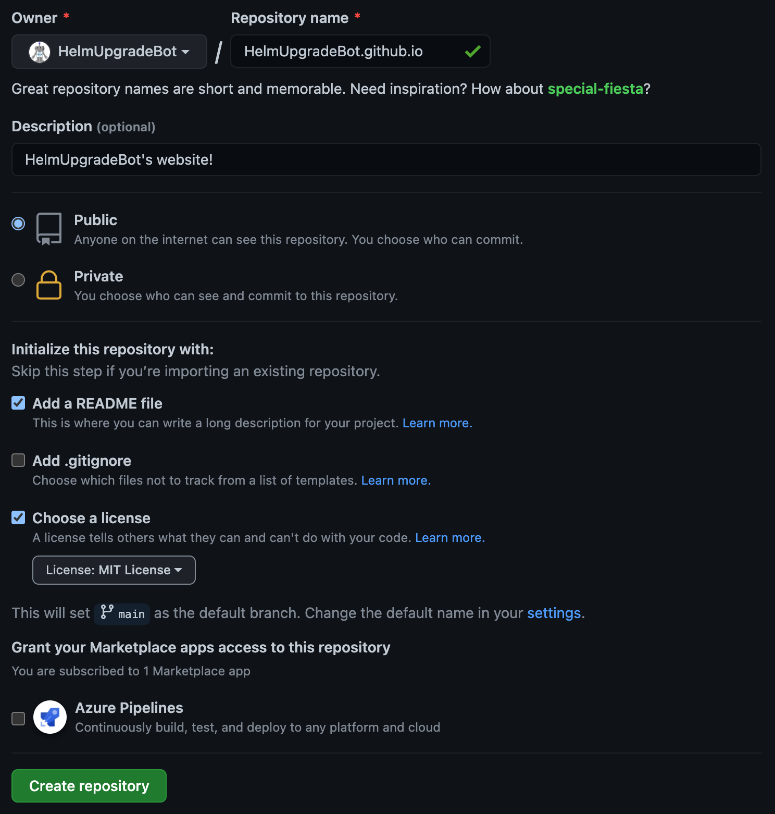
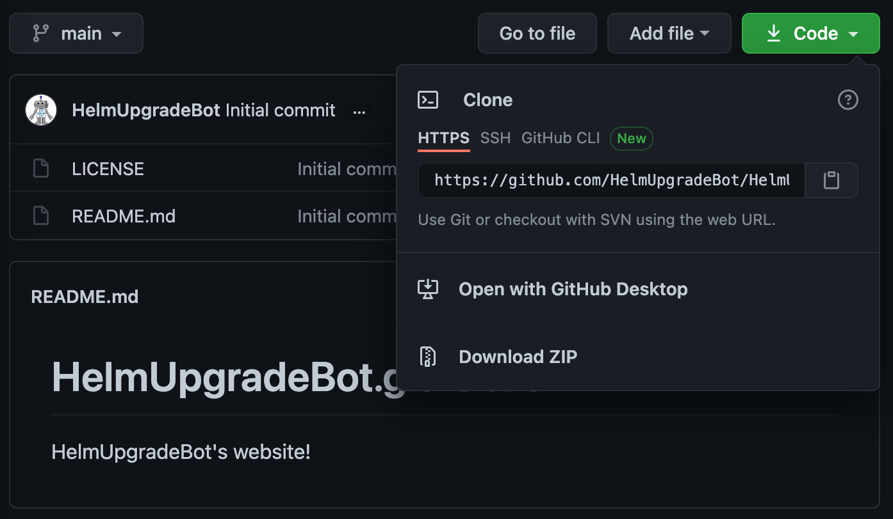

In this first episode, we will create the repository that will host our website on GitHub.
We will do this entirely in the browser and we will also assume that your GitHub account is called `HelmUpgradeBot`.

1. Go to <https://github.com> and sign in to your account
2. In the top, right-hand corner of the browser, click the plus `+` symbol and select "New repository" from the dropdown menu.
3. Give your repository the name `HelmUpgradeBot.github.io`.
   This is a special GitHub repository that will act as your website.
   Make sure that it is **public**!
   (You can have private GitHub Pages sites, but they cost money!)
    - Also add a README file to your repository and a license (the MIT license has been used in the example below but you might prefer [Creative Commons](https://github.com/idleberg/Creative-Commons-Markdown)).
    - Once you're happy, click "Create repository"

|  |
| :---: |
| Example of how to fill in GitHub's create repository form |

4. Once your GitHub repo has been created, click the large, green "code" button in the top-right, make sure "HTTPS" is selected, and click the clipboard icon to copy the contents of the text box.

|  |
| :---: |
| Where to find the address of your GitHub repo |


